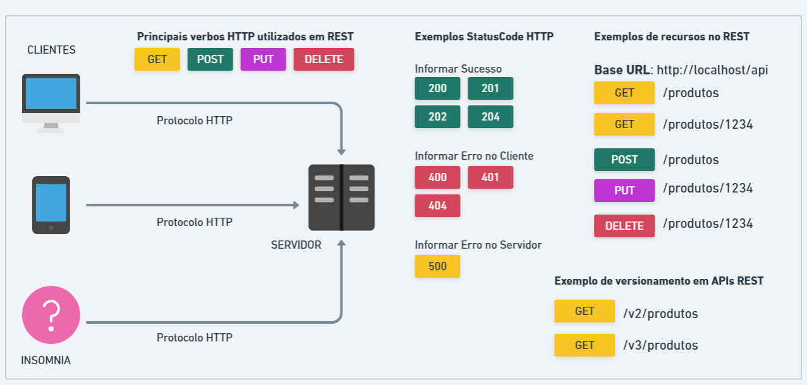

# Aulas matéria SOA - 2º semestre 2025

Estilo de Arquitetura REST FULL

Desenvolvido na linguagem:  

## Aula de Introdução sobre REST

## Aula 01 - Configuração das Rotas e Conexão com Banco de dados
[Fontes](https://github.com/wllsistemas/soa_202502/tree/main/aula_01)

## Aula 02 - Testes de CRUD e construção das rotas SelectAll e SelectById
[Fontes](https://github.com/wllsistemas/soa_202502/tree/main/aula_02)

## Aula 03 - Validação, Tranformação de Dados, Verificação de Duplicações
[Fontes](https://github.com/wllsistemas/soa_202502/tree/main/aula_03)