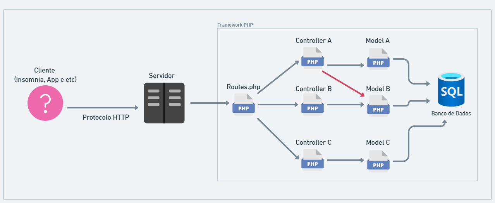

# Aula 01

Primeira aula com desenvolvimento de código usando framework.

## Resumo da Aula
- Configuração das rotas no arquivos **Routes.php**
- Desenvolvimento da classe Controller e seus métodos
- Controllers recebendo parâmetros via url no **Request** (GET, PUT e DELETE)
- Controllers recebendo dados no corpo do **Request** (POST e PUT)
- Controllers devolvendo **Status Code HTTP** 
- Controllers devolvendo **Responses** com estrutura JSON
- Configuração da conexão com o banco de dados no **Conexao.php**
- Testes de conexão com o objeto **PDO**

## Fluxo de uma requisição no framework
